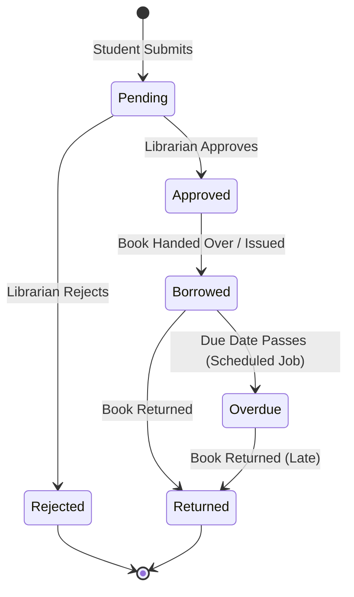

# Database Schema and Application Architecture

This document defines the tables, fields, roles, access controls, and relationship structures for the ServiceNow Library Management System (LMS).

---

## 1. Custom Table: Book (`u_book`)

The `u_book` table stores the library's catalog. Each book has copy counts and status fields to track general availability.

### Fields
| Column Name | Field Label | Data Type | Length / Max | Attributes / Choices / Settings |
| :--- | :--- | :--- | :--- | :--- |
| `number` | Book ID | String | 40 | Auto-numbered (Prefix: `BOK`, Digits: 7), Read-only |
| `u_title` | Title | String | 100 | **Mandatory**, **Display Value = true** |
| `u_author` | Author | String | 100 | **Mandatory** |
| `u_isbn` | ISBN | String | 20 | **Mandatory**, Unique (validated via script) |
| `u_category` | Category | Choice | - | Choices: `fiction` (Fiction), `non_fiction` (Non-Fiction), `science` (Science), `history` (History), `technology` (Technology), `biography` (Biography), `reference` (Reference) |
| `u_publisher` | Publisher | String | 100 | Optional |
| `u_publication_year`| Publication Year | Integer | 4 | Optional |
| `u_available_copies`| Available Copies | Integer | - | **Mandatory**, Default: `1`, Cannot be negative |
| `u_total_copies` | Total Copies | Integer | - | **Mandatory**, Default: `1`, Must be >= `Available Copies` |
| `u_status` | Status | Choice | - | Default: `available` Choices: - `available` (Available) - `borrowed` (Borrowed) - `reserved` (Reserved) - `lost` (Lost) |
| `u_shelf_location` | Shelf Location | String | 40 | Optional (e.g., "Aisle 3, Shelf B") |
| `u_description` | Description | String (HTML) | 4000 | Optional description or summary |

---

## 2. Custom Table: Borrow Request (`u_borrow_request`)

The `u_borrow_request` table tracks book transactions. It represents the lifecycle of a borrow request from creation to return.

### Fields
| Column Name | Field Label | Data Type | Length / Max | Attributes / Choices / Settings |
| :--- | :--- | :--- | :--- | :--- |
| `number` | Request ID | String | 40 | Auto-numbered (Prefix: `BRQ`, Digits: 7), Read-only |
| `u_student` | Student | Reference | - | References `sys_user`. Mandatory. Default: dynamic `gs.getUserID()` (for student submissions). |
| `u_book` | Book | Reference | - | References `u_book`. Mandatory. Reference Qualifier: `u_available_copies > 0` and `u_status = 'available'`. |
| `u_request_date` | Request Date | Date/Time | - | Default: current time `javascript:gs.nowDateTime()`. Mandatory. |
| `u_approval_date` | Approval Date | Date/Time | - | Populated automatically on approval. Read-only. |
| `u_due_date` | Due Date | Date | - | Mandatory. Default: 14 days from approval. |
| `u_return_date` | Return Date | Date/Time | - | Populated automatically on book return. Read-only. |
| `u_status` | Status | Choice | - | Default: `pending` Choices: - `pending` (Pending) - `approved` (Approved) - `rejected` (Rejected) - `borrowed` (Borrowed) - `returned` (Returned) - `overdue` (Overdue) |
| `u_librarian_comments`| Librarian Comments | String | 1000 | Optional. Editable only by Librarians. |
| `assignment_group` | Assignment Group | Reference | - | References `sys_user_group`. Default: group `Librarians`. |
| `assigned_to` | Assigned To | Reference | - | References `sys_user` (filtered by group `Librarians`). |

---

## 3. User Roles
- **Student (`u_library_student`)**: Can search catalog, submit requests, and check their own history.
- **Librarian (`u_library_librarian`)**: Can perform CRUD on books, manage borrow requests, run reports.

---

## 4. Access Control Lists (ACLs)

### Table-Level Access
| Table | Role | Operation | Condition / Script | Description |
| :--- | :--- | :--- | :--- | :--- |
| `u_book` | `u_library_student` | `read` | None | Students can view all book records. |
| `u_book` | `u_library_librarian`| `*` (All) | None | Librarians have Full CRUD on Books. |
| `u_borrow_request`| `u_library_student` | `create` | None | Students can create borrow requests. |
| `u_borrow_request`| `u_library_student` | `read` | `u_student = javascript:gs.getUserID()` | Students can only see their own requests. |
| `u_borrow_request`| `u_library_student` | `write` | `u_student = javascript:gs.getUserID() && u_status = 'pending'` | Students can edit comments or cancel pending requests. |
| `u_borrow_request`| `u_library_librarian`| `*` (All) | None | Librarians can perform full CRUD on requests. |

### Field-Level Access (Critical Restrictions)
To prevent students from altering workflow fields:
- `u_borrow_request.*`:
  - `write`: Only `u_library_librarian` role can edit fields like `u_status`, `u_due_date`, `u_approval_date`, `u_return_date`, and `u_librarian_comments`.
- `u_borrow_request.u_student`, `u_borrow_request.u_book`:
  - `write`: Allow `u_library_student` on create or when status is `pending`.

---

## 5. Status Transitions & Lifecycles

### State Explanations
1. **Pending**: Initial state upon student request. Book copies are not yet reduced.
2. **Approved**: Librarian verifies and approves the request. `Available Copies` decreases by 1.
3. **Borrowed**: Book is physically checked out. (In many workflows, Approved transitions immediately to Borrowed upon hand-off).
4. **Returned**: Book is returned. `Available Copies` increases by 1.
5. **Overdue**: Scheduled daily job checks if `u_due_date` has passed and `u_status` is `Borrowed`.
